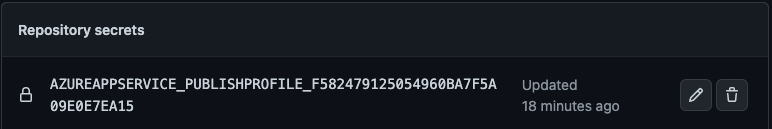
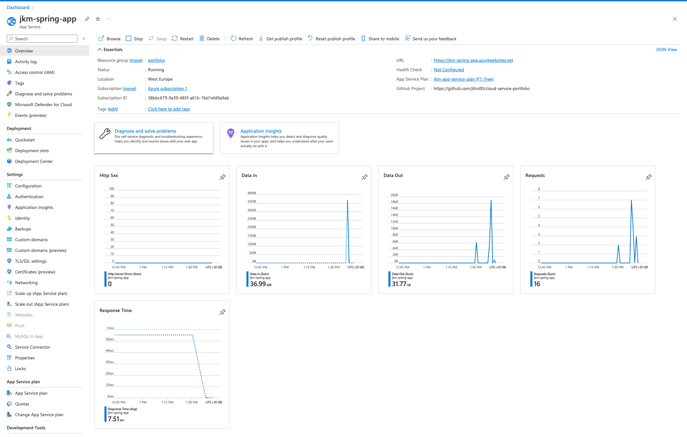
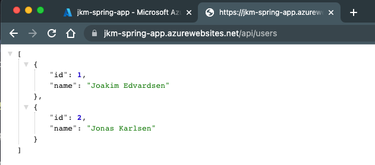

# CI/CD Pipeline

**The CI/CD Pipeline defines a set of instruction to test, build and deploy the spring boot application. These instructions are executed on every push to the main branch.**

<!-- TABLE OF CONTENTS -->
<h2>Table of Contents</h2>

- [Motivation](#motivation)
- [Tools - Which tools and why](#tools)
- [Architecture](#architecture)
- [Pipeline Loaction - where to find the pipeline config](#location)
- [Pipeline Triggers - how the pipeline is triggered](#triggers)
- [Pipeline Jobs - what is done during the pipeline](#jobs)
  - [Unit testing](#unit-test)
  - [Sonar Cloud analyzing](#sonar-cloud-analyzing)
  - [Building](#building)
  - [Deploying](#deploying)
- [Experiences](#experiences)
- [Further works](#further-works)
- [Complete Pipeline Configuration](#pipeline-config)
- [Sources & Resources](#sources)

<!-- Motivation -->
<h2 id="motivation">Motivation</h2>

<!-- TODO: Motivation of why I chose the apps/tools. Something like I've created multiple spinrg boot apps but never actaully deployed any. Used a little docker before, but not to this extend... -->

<!-- Tools -->
<h2 id="tools">Tools - Which tools and why</h2>

<!-- TODO: describe the tools used / why -->

- Spring boot: To create a basic web application that can be deployed and tested.
- Sonar Cloud: Analyze the project for security, code smells, test coverage etc... Gives good feedback on the code with a clear dashboard.
- Docker: Containerize the application, both the spring boot web app but also the postgreSQL database the spring boot app should be connected to.
- Azuer: Production environment to host the application. Tested multiple cloud service providers earlier in the semester and ended up liking azure the most. Has a clean dashboard, ease to understand walk-throughs when setting up resources and a lot of documentation for when you are stuck.

<h2 id="architecture">Architecture</h2>

<!-- TODO: describe the architecture of the deployment environment -->

<!-- Location -->
<h2 id="location">Pipeline Location</h2>

The pipeline file are store under `.github/workflows/build.yml`

<!-- Triggers -->
<h2 id="triggers">Pipeline Triggers</h2>

The pipeline is triggered whenever a change is pushed to the main branch.

```yml
on:
  push:
    branches:
      - main
```

_Pipeline trigger config_

<!-- Jobs -->
<h2 id="jobs">Pipeline Jobs</h2>

The pipeline consits of 4 jobs:

1.  [Unit testing](#unit-test)
2.  [Sonar Cloud analyzing](#sonar-cloud-analyzing)
3.  [Building](#building)
4.  [Deploying](#deploying)

<!-- Jobs: Unit testing -->
<h3 id="unit-test">Unit test</h3>

The unit test job makes sure all the unit test specified in the test folder of the application is executed and the job is succesfull only if all the unit test passes. If not the pipeline is canceled with logs of which test failed.

|  |
| :-----------------------------------------------------------------: |
|                 **Job: Unit testing, succesfull!**                  |

|  |
| :--------------------------------------------------------------: |
|               **Test results fron unit test job**                |

<!-- TODO: Add screenshots of failing tests -->

```yml
tests:
  name: Unit tests
  runs-on: ubuntu-latest
  steps:
    # Check out repo
    - uses: actions/checkout@v1
    # Set up JDK
    - name: Set up JDK
      uses: actions/setup-java@v1
      with:
        java-version: "17"
    # Set up maven
    - name: Cache Maven packages
      uses: actions/cache@v1
      with:
        path: ~/.m2
        key: ${{ runner.os }}-m2-${{ hashFiles('**/pom.xml') }}
        restore-keys: ${{ runner.os }}-m2
    # Run tests
    - name: Run Tests
      run: mvn -B test
      working-directory: ./portfolio-api
```

_Pipeline config for unit testing_

For the unit test job, an ubunt VM is booted up, a JDK is downloaded and initialized as well as maven, before the application is executed with the maven test command.

_**Note:** Need to specify working directory when executing the tests because the appliaction does not live in the root of the repository._

<!-- Jobs: Sonar Cloud analyzing -->
<h3 id="sonar-cloud-analyzing">Sonar Cloud analyzing</h3>

Runs the appliaction with Sonar Cloud to analyze the project and given feedback on bugs, security issues, test coverage, maintainability, etc... A summary of the appliaction state could be found on Sonar Cloud service.

|  |
| :--------------------------------------------------------------------------------------: |
|                                **Sonar Cloud Dashboard**                                 |

For github to get access to Sonar Cloud a token is stored as a repository secret: `settings -> secrets -> actions`. This token is used directly in the pipeline job. Only admins of the repository have access to the token.

|  |
| :--------------------------------------------------------------------: |
|           **Sonar Cloud token stored as repository secret**            |

```yml
sonar:
  # Make sure test job is succesfull
  needs: tests
  name: SonarCloud analysis
  runs-on: ubuntu-latest
  # Step's required for the job
  steps:
    # Check-out repository
    - uses: actions/checkout@v2
      with:
        fetch-depth: 0 # Shallow clones should be disabled for a better relevancy of analysis
    # Sets up JDK
    - name: Set up JDK
      uses: actions/setup-java@v1
      with:
        java-version: "17"
    # Sets up SonarCloud cache
    - name: Cache SonarCloud packages
      uses: actions/cache@v1
      with:
        path: ~/.sonar/cache
        key: ${{ runner.os }}-sonar
        restore-keys: ${{ runner.os }}-sonar
    # Sets up Maven cache
    - name: Cache Maven packages
      uses: actions/cache@v1
      with:
        path: ~/.m2
        key: ${{ runner.os }}-m2-${{ hashFiles('**/pom.xml') }}
        restore-keys: ${{ runner.os }}-m2
    # Uses SonarCloud to analyze the project
    - name: Build and analyze
      env:
        GITHUB_TOKEN: ${{ secrets.GITHUB_TOKEN }} # Needed to get PR information, if any
        SONAR_TOKEN: ${{ secrets.SONAR_TOKEN }}
      run: mvn -B verify org.sonarsource.scanner.maven:sonar-maven-plugin:sonar -Dsonar.projectKey=jKm00_cloud-service-portfolio -Dspring.profiles.active=test
      working-directory: ./portfolio-api
```

_Pipeline config for Sonar Cloud analyze_

This job is also ran on an ubuntu VM where a JDK and maven have to be downloaded and installed (using github actions) as well as SonarCloud have to be initialized.

<!-- Jobs: Building -->
<h3 id="building">Building</h3>

Before the app can be deployed, it needs to be built. That's what this job does. After the job has build the application, the `.jar` file is uploaded as an artifact, with name `portfolio-api`, so it can be shared across the pipeline jobs.

|                |
| :----------------------------------------------------------------------: |
| **Uploaded artifact by pipeline job** _(can be downloaded and executed)_ |

```yml
build:
  # Make sure sonar job is succesfull
  needs: sonar
  name: Build
  runs-on: ubuntu-latest
  steps:
    #Check-out repository
    - uses: actions/checkout@v1
    #Set up JDK
    - name: Set up JDK
      uses: actions/setup-java@v1
      with:
        java-version: "17"
    #Set up Maven cache
    - name: Cache Maven packages
      #This action allows caching dependencies and build outputs to improve workflow execution time.
      uses: actions/cache@v1
      with:
        path: ~/.m2
        key: ${{ runner.os }}-m2-${{ hashFiles('**/pom.xml') }}
        restore-keys: ${{ runner.os }}-m2
    #Build the application using Maven
    - name: Build with Maven
      run: mvn -B package -DskipTests --file pom.xml
      working-directory: ./portfolio-api
    # Upload build version of application
    - name: Upload JAR
      #This uploads artifacts from your workflow allowing you to share data between jobs and store data once a workflow is complete.
      uses: actions/upload-artifact@v2
      with:
        name: portfolio-api
        #From this path
        path: portfolio-api/target/portfolio-api-1.0.jar
```

_Pipeline config for building_

<h3 id="deploying">Deploying</h3>

The job responsible for deploying the spring boot application from the repository to the azure web app. Uses the artifact generated from the previous job (build) and uploads it to the azure web app before it's ran.

For github to get access to the azuer web application another secret has to be stored in the repository:

|  |
| :----------------------------------------------------------: |
|              Azure secret stored in repository               |

|  |
| :---------------------------------------------------------------------------------------: |
|                         Succesfull Pipeline with Azure Deployment                         |

|  |
| :------------------------------------------------------------------------------: |
|                              Azure Wen App Overview                              |

|  |
| :------------------------------------------------------------------------------: |
|                    Accessing api endpoint from azure web app                     |

```yml
deploy:
  needs: build
  name: Deploy
  runs-on: ubuntu-latest
  environment:
    name: "Production"
    url: ${{ steps.deploy-to-webapp.outputs.webapp-url }}

  steps:
    - name: Download artifact from build job
      uses: actions/download-artifact@v2
      with:
        name: portfolio-api

    - name: Deploy to Azure Web App
      id: deploy-to-webapp
      uses: azure/webapps-deploy@v2
      with:
        app-name: "jkm-spring-app"
        slot-name: "Production"
        publish-profile: ${{ secrets.AZUREAPPSERVICE_PUBLISHPROFILE_F582479125054960BA7F5A09E0E7EA15 }}
        package: "*.jar"
```

_Pipeline config for deployment_

<h2 id="iterations">Iterations / Experiences</h2>

1. First I created the basic spring boot applicaiton with some endpoints. I wanted to connect the application to a database to challenge myself to have more than one service. In the beginning I created the app with an in memory database with the tought of moving this to a postgreSQL later in production. I would anyways need the in memory database configuration for testing to make sure I would have consistant test results.

2. Next I started creating the pipeline. The first thing I wanted to complete was automated testing. For this I also needed to implement some unit test that would be run in the pipeline. The pipeline configuration was pretty straight forward. Just needed to setup a VM where I could execute all the tests.

3. After doing some research, I found an iteresting tool, Sonar Cloud, that we were introduced to in the first year, but a tool that I had forgot about. After rediscovering this I wanted to implement it in the pipeline to get automated analyzing of the applicaiton. There were some challenges with this step like getting a token and storing it as a secret as well as actually using that token in the pipeline itself.

4. The next and final step I wanted to complete was deploying the application, however I needed to build the application first. So this became a naturall step by itself. The main challenge with this step were to figure out how to store the built applicaiton so I could use it later to deploy.

5. Now I could takle the finally step, deploying. I had tested some cloud providers earlier in the semester and found that I liked azure the most. That's why I ended up with using azure for this portfolio as well. Before I could configure the pipeline to automatically deploy, I had to configure a web application in azure that I could deploy my app to. This was done using azures portal interface. When this was created, azure automatically genereted a workflow file that I could just merge into my own.

One extremly good reasen to use azure is their documentation. I had some challeneges along the way, but looking it up always yeilded a result where my pipeline ended up with a green checkmark.

_Everything was done with version controll, meaning you can go to the [github repository](https://github.com/jKm00/cloud-service-portfolio) and view all the commits along the way as well as a history of all the executed workflows under the actions tab._

<h2 id="further-works">Further Works</h2>

<!-- Complete Pipeline Configuartion -->
<!-- TODO: Update this section with finished pipeline -->
<h2 id="pipeline-config">Complete Pipeline Configuration</h2>

```yml
name: CI/CD Pipeline
on:
  push:
    branches:
      - main

jobs:
  # Test the application
  tests:
    name: Unit tests
    runs-on: ubuntu-latest
    steps:
      # Check out repo
      - uses: actions/checkout@v2
      # Set up JDK
      - name: Set up JDK
        uses: actions/setup-java@v3
        with:
          distribution: "temurin"
          java-version: "17"
          cache: "maven"
      # Run tests
      - name: Run Tests
        run: mvn -B test
        working-directory: ./portfolio-api

  # Sona's job
  sonar:
    # Make sure test job is succesfull
    needs: tests
    name: SonarCloud analysis
    runs-on: ubuntu-latest
    # Step's required for the job
    steps:
      # Check-out repository
      - uses: actions/checkout@v2
        with:
          fetch-depth: 0 # Shallow clones should be disabled for a better relevancy of analysis
      # Set up JDK
      - name: Set up JDK
        uses: actions/setup-java@v3
        with:
          distribution: "temurin"
          java-version: "17"
          cache: "maven"
      # Sets up SonarCloud cache
      - name: Cache SonarCloud packages
        uses: actions/cache@v1
        with:
          path: ~/.sonar/cache
          key: ${{ runner.os }}-sonar
          restore-keys: ${{ runner.os }}-sonar
      # Uses SonarCloud to analyze the project
      - name: Build and analyze
        env:
          GITHUB_TOKEN: ${{ secrets.GITHUB_TOKEN }} # Needed to get PR information, if any
          SONAR_TOKEN: ${{ secrets.SONAR_TOKEN }}
        run: mvn -B verify org.sonarsource.scanner.maven:sonar-maven-plugin:sonar -Dsonar.projectKey=jKm00_cloud-service-portfolio -Dspring.profiles.active=test
        working-directory: ./portfolio-api

  # Build the application for production
  build:
    # Make sure sonar job is succesfull
    needs: sonar
    name: Build
    runs-on: ubuntu-latest
    steps:
      #Check-out repository
      - uses: actions/checkout@v2
      # Set up JDK
      - name: Set up JDK
        uses: actions/setup-java@v3
        with:
          distribution: "temurin"
          java-version: "17"
          cache: "maven"
      #Build the application using Maven
      - name: Build with Maven
        run: mvn -B package -DskipTests --file pom.xml
        working-directory: ./portfolio-api
      # Upload build version of application
      - name: Upload JAR
        #This uploads artifacts from your workflow allowing you to share data between jobs and store data once a workflow is complete.
        uses: actions/upload-artifact@v2
        with:
          name: portfolio-api
          #From this path
          path: portfolio-api/target/portfolio-api-1.0.jar
```

_Config file_

|  |
| :-------------------------------------------------------------------------: |
|                        **Complete Pipeline Summary**                        |

<h2 id="sources">Sources & Resources</h2>

- [Pipeline configuration guide](https://aws.plainenglish.io/hands-on-ci-cd-for-spring-boot-applications-using-github-actions-and-aws-1cbc1e2c9d54)
- [GitHub Actions: Java with maven guide](https://github.com/actions/setup-java#caching-packages-dependencies)
- [Sonar Cloud Github Actions](https://github.com/SonarSource/sonarcloud-github-action)
- [GitHub Repository](https://github.com/jKm00/cloud-service-portfolio)
