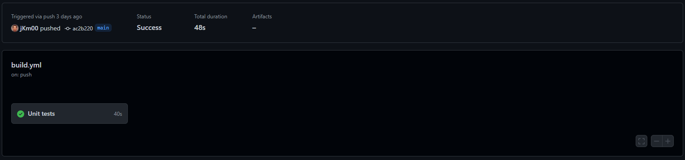
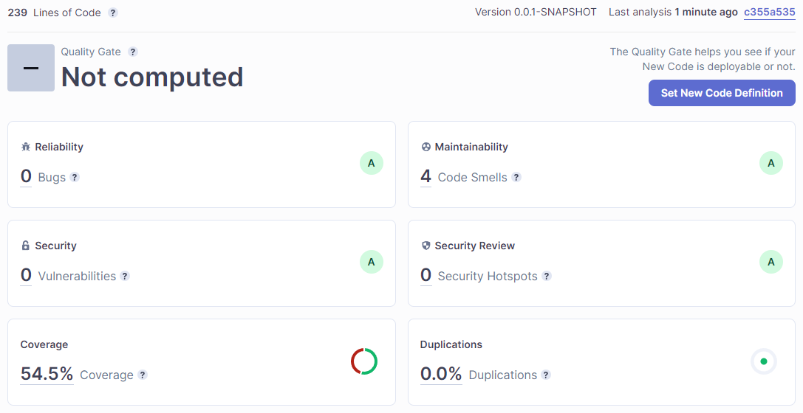

# CI/CD Pipeline

**The CI/CD Pipeline defines a set of instruction to test, build and deploy the spring boot application. These instructions are executed on every push to the main branch.**

## Location

The pipeline file are store under `.github/workflows/build.yml`

## Triggers

The pipeline is triggered whenever a change is pushed to the main branch.

```yml
on:
  push:
    branches:
      - main
```

_Pipeline trigger config_

## Jobs

The pipeline consits of 4 jobs:

1.  [Unit testing](#unit-test)
2.  [Sonar Cloud analyzing](#sonar-cloud-analyzing)
3.  [Building](#building)
4.  [Deploying](#deploying)

<h3 id="unit-test">Unit test</h3>

The unit test job makes sure all the unit test specified in the test folder of the application is executed and the job is succesfull only if all the unit test passes. If not the pipeline is canceled with logs of which test failed.

|  |
| :-----------------------------------------------------------------: |
|                 **Job: Unit testing, succesfull!**                  |

|  |
| :--------------------------------------------------------------: |
|               **Test results fron unit test job**                |

```yml
tests:
  name: Unit tests
  runs-on: ubuntu-latest
  steps:
    # Check out repo
    - uses: actions/checkout@v1
    # Set up JDK
    - name: Set up JDK
      uses: actions/setup-java@v1
      with:
        java-version: '17'
    # Set up maven
    - name: Cache Maven packages
      uses: actions/cache@v1
      with:
        path: ~/.m2
        key: ${{ runner.os }}-m2-${{ hashFiles('**/pom.xml') }}
        restore-keys: ${{ runner.os }}-m2
    # Run tests
    - name: Run Tests
      run: mvn -B test
      working-directory: ./portfolio-api
```

_Pipeline config for unit testing_

For the unit test job, an ubunt VM is booted up, a JDK is downloaded and initialized as well as maven, before the application is executed with the maven test command.

_**Note:** Need to specify working directory when executing the tests because the appliaction does not live in the root of the repo._

<h3 id="sonar-cloud-analyzing">Sonar Cloud analyzing</h3>

Runs the appliaction with Sonar Cloud to analyze the project and given feedback on bugs, security issues, test coverage, maintainability, etc... A summary of the appliaction state could be found on Sonar Cloud service.

|  |
| :--------------------------------------------------------------------------------------: |
|                                **Sonar Cloud Dashboard**                                 |

For github to get access to Sonar Cloud a token is stored as a repository secret: `settings -> secrets -> actions`. This token is used directly in the pipeline job. Only admins of the repository have access to the token.

|  |
| :--------------------------------------------------------------------: |
|           **Sonar Cloud token stored as repository secret**            |

```yml
sonar:
  # Make sure test job is succesfull
  needs: tests
  name: SonarCloud analysis
  runs-on: ubuntu-latest
  # Step's required for the job
  steps:
    # Check-out repository
    - uses: actions/checkout@v2
      with:
        fetch-depth: 0 # Shallow clones should be disabled for a better relevancy of analysis
    # Sets up JDK
    - name: Set up JDK
      uses: actions/setup-java@v1
      with:
        java-version: '17'
    # Sets up SonarCloud cache
    - name: Cache SonarCloud packages
      uses: actions/cache@v1
      with:
        path: ~/.sonar/cache
        key: ${{ runner.os }}-sonar
        restore-keys: ${{ runner.os }}-sonar
    # Sets up Maven cache
    - name: Cache Maven packages
      uses: actions/cache@v1
      with:
        path: ~/.m2
        key: ${{ runner.os }}-m2-${{ hashFiles('**/pom.xml') }}
        restore-keys: ${{ runner.os }}-m2
    # Uses SonarCloud to analyze the project
    - name: Build and analyze
      env:
        GITHUB_TOKEN: ${{ secrets.GITHUB_TOKEN }} # Needed to get PR information, if any
        SONAR_TOKEN: ${{ secrets.SONAR_TOKEN }}
      run: mvn -B verify org.sonarsource.scanner.maven:sonar-maven-plugin:sonar -Dsonar.projectKey=jKm00_cloud-service-portfolio -Dspring.profiles.active=test
      working-directory: ./portfolio-api
```

_Pipeline config for Sonar Cloud analyze_

This job is also ran on an ubuntu VM where a JDK and maven have to be downloaded and installed (using github actions) as well as SonarCloud have to be initialized.

<h3 id="building">Building</h3>

Before the app can be deployed, it needs to be built. That's what this job does. After the job has build the application, the `.jar` file is uploaded as an artifact, with name `portfolio-api`, so it can be shared across the pipeline jobs.

|                |
| :----------------------------------------------------------------------: |
| **Uploaded artifact by pipeline job** _(can be downloaded and executed)_ |

```yml
build:
  # Make sure sonar job is succesfull
  needs: sonar
  name: Build
  runs-on: ubuntu-latest
  steps:
    #Check-out repository
    - uses: actions/checkout@v1
    #Set up JDK
    - name: Set up JDK
      uses: actions/setup-java@v1
      with:
        java-version: '17'
    #Set up Maven cache
    - name: Cache Maven packages
      #This action allows caching dependencies and build outputs to improve workflow execution time.
      uses: actions/cache@v1
      with:
        path: ~/.m2
        key: ${{ runner.os }}-m2-${{ hashFiles('**/pom.xml') }}
        restore-keys: ${{ runner.os }}-m2
    #Build the application using Maven
    - name: Build with Maven
      run: mvn -B package -DskipTests --file pom.xml
      working-directory: ./portfolio-api
    # Upload build version of application
    - name: Upload JAR
      #This uploads artifacts from your workflow allowing you to share data between jobs and store data once a workflow is complete.
      uses: actions/upload-artifact@v2
      with:
        name: portfolio-api
        #From this path
        path: portfolio-api/target/portfolio-api-1.0.jar
```

_Pipeline config for building_
