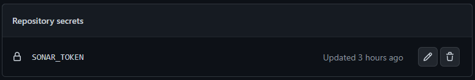

Joakim Edvardsen

<h1><b>CI/CD Pipeline</b></h1>

<!-- TABLE OF CONTENTS -->

<h2><b>Table of Contents</b></h2>

- [Motivation](#motivation)
- [Tools - Which tools and why](#tools)
  - [Which tools and why](#tools-and-why)
  - [Pros & Cons](#pros-and-cons)
- [Architecture](#architecture)
- [Pipeline](#pipeline)
  - [Location - where to find the pipeline config](#location)
  - [Triggers - how the pipeline is triggered](#triggers)
  - [Jobs - what is done during the pipelone](#jobs)
    - [Unit testing](#unit-test)
    - [Sonar Cloud Analyzing](#sonar-cloud-anaøyzing)
    - [Building](#building)
    - [Deploying](#deploying)
- [Iterations](#iterations)
- [Experiences](#experiences)
- [Further works](#further-works)
- [Complete Pipeline Configuration](#pipeline-config)
- [Sources & Resources](#sources)

<!-- Motivation -->
<h2 id="motivation"><b>Motivation</b></h2>
Today, when working with a software product, you often want a fully functional and automated pipeline that works from code commit to production/test environment. But what are the motivations behind this?

By having a working pipeline you can be more confident that every feature of your software product that is pushed to production is tested and working correctly.

A pipeline makes it much easier to work with continuous integration and continuous delivery (CI/CD) by having everything automated. Everything a developer has to do when he is finished implementing a new feature, is to press a single button that will trigger the pipeline. When the pipeline is complete, the developer and every one else on the team will either get confirmation that everything is still working or that something broke an has to be fixed.

One of the main reasons we want to have CI/CD is to rappidly deliver new features and refactor our code to make it better and more efficient. This will also yield in more rappidly feedback from the end user.

_**Side note:** When to push new features to production should often be a business decision. That's why for most pipelines you don't want to automatically deploy it to production. Rather to a staging environment where it can be staged to confirm everything is working and have a working product with all the new features on stand-by ready to be deploy to production when the decision is made._

<!-- Tools -->
<h2 id="tools"><b>Tools</b></h2>

<h3 id="tools-and-why"><b>Which tools and why</b></h3>

In my pipeline I've used five different tools, all working together to create, test, build, deploy and give feedback.

<h4><b>Spring boot</b></h4>

To create a basic web application that can be deployed and tested.

<h4><b>Sonar Cloud</b></h4>

Static code analyzing tool for analyzing the project for security, code smells, test coverage etc... Gives good feedback on the code with a clear dashboard.

<h4><b>Docker</b></h4>

Containerize the application, both the spring boot web app but also the postgreSQL database the spring boot app should be connected to.

<h4><b>GitHub Actions</b></h4>

Setting up a pipeline with triggers based on repository events directly together with the rest of my code base.

<h4><b>Azure</b></h4>

Production environment to host the application. Tested multiple cloud service providers earlier in the semester and ended up liking azure the most. Has a clean dashboard, ease to understand walk-throughs when setting up resources and a lot of documentation for when you are stuck.

<h3 id="pros-and-cons"><b>Pros & Cons</b></h3>

<h4><b>Sonar Cloud</b></h4>

You might have heard of Sonar Lint for developing programs, giving you feedback in your IDE when your are writing code on code smells, bugs, security etc... Sonar Cloud does the same, only in the cloud. This is very handy and gives you a quick overview on the state of your application as well as feedback on improvments you can make to your code base.

All though it's handy, it is another tool in your pipeline you have to pay for. For small hobby projects you can probably get away without paying, however for bigger projects in companies you have to pay for the service. You have to make the decision if it's worth having.

<h4><b>GitHub Actions for GitOps</b></h4>

One of the nice things with using GitHub Actions is that you have everything in one place. You normally store your sorce code with version controll so why not store your infrastructure and pipeline the same way? However, with this approche you might end up getting locked in to the git provider, making it more difficult to change your/the teams workflow if you want to move from the original git provider.

<h4><b>Azure</b></h4>

Many companies today use Azure as their cloud service providers. One of the main reasons is often that they already have other Microsoft services making Azure more simular and ease to understand. It is beneficial to have some experience with Azure, however Azure also makes itself more pleasent to work with due to its extensive documentation.

For some, Azure might seem at bit expensive, but a lot of the costs goes to their Microsoft license which companies sometimes pay for anyways due to having other Microsoft services, making the cost much less expensive.

With Azure you can create your own dashboard, pinning resources to it to get an overview over all the resources your currently have setup. This leads to you, the owner of these resources, beeing fully aware so you don't have resources running that you do not use.

<!-- TODO: describe the architecture of the deployment environment -->
<!-- <h2 id="architecture">Architecture</h2> -->

<!-- Pipeline -->
<h2 id="pipeline"><b>Pipeline</b></h2>

The pipeline defines all the steps that should be taken whenever a change is committed to the repository. It also defines when these steps should be triggered.

<!-- Location -->
<h3 id="location"><b>Pipeline Location</b></h3>

The pipeline configuration file are stored under version controll in the [GitHub repository](https://github.com/jKm00/cloud-service-portfolio) under `.github/workflows/build.yml`

<!-- Triggers -->
<h3 id="triggers"><b>Pipeline Triggers</b></h3>

The pipeline is triggered whenever a change is pushed to the main branch. You can also configure it to be triggered whenever a pull request to the main branch is opened. This is ususally how teams work, by creating a new branch where a single developer can work on a singel new feature. When it's implemented, the developer opens up a pull requrest to the main branch, which triggers the pipeline as well as other developers can review the new changes.

Since I've worked on this project alone, I didn't find any reasons to work like this. Instead I just pushed every change direclty to the main branch.

```yml
on:
  push:
    branches:
      - main
```

_Pipeline trigger config_

<!-- Jobs -->
<h3 id="jobs"><b>Pipeline Jobs</b></h3>

The pipeline consits of four jobs, each responsible for a subtask of the pipeline to be able to run, test, build and deploy the application:

1.  [Unit testing](#unit-test)
2.  [Sonar Cloud analyzing](#sonar-cloud-analyzing)
3.  [Building](#building)
4.  [Deploying](#deploying)

<!-- Jobs: Unit testing -->
<h4 id="unit-test"><b>Unit test</b></h4>

The unit test job makes sure all the unit test specified in the test folder of the application is executed and the job is succesfull only if all the unit tests passes. If not the pipeline is canceled with logs of which test failed.

|  |
| :-----------------------------------------------------------------: |
|                 **Job: Unit testing, succesfull!**                  |

|  |
| :--------------------------------------------------------------: |
|               **Test results fron unit test job**                |

If one or more tests fails, the pipeline is cancelled and the test result is logged in the `test` step of the pipeline. You can navigate your way to it and have a look at what went wrong to make it easier to pin-point what needs to be fixed.

|  |
| :------------------------------------------------------------------------------------: |
|                   **Pipeline canceled when on or more tests fails**                    |

|  |
| :---------------------------------------------------------------------------------: |
|                        **Log output when some tests fails**                         |

```yml
tests:
  name: Unit tests
  runs-on: ubuntu-latest
  steps:
    # Check out repo
    - uses: actions/checkout@v1
    # Set up JDK
    - name: Set up JDK
      uses: actions/setup-java@v1
      with:
        java-version: '17'
    # Set up maven
    - name: Cache Maven packages
      uses: actions/cache@v1
      with:
        path: ~/.m2
        key: ${{ runner.os }}-m2-${{ hashFiles('**/pom.xml') }}
        restore-keys: ${{ runner.os }}-m2
    # Run tests
    - name: Run Tests
      run: mvn -B test
      working-directory: ./portfolio-api
```

_Pipeline config for unit testing_

For the unit test job, an ubunt VM is booted up, a JDK is downloaded and initialized as well as maven, before the application is executed with the maven test command.

_**Note:** Need to specify working directory when executing the tests because the appliaction does not live in the root of the repository._

<!-- Jobs: Sonar Cloud analyzing -->
<h4 id="sonar-cloud-analyzing"><b>Sonar Cloud analyzing</b></h4>

Runs the appliaction with Sonar Cloud to analyze the project and given feedback on bugs, security issues, test coverage, maintainability, etc... A summary of the appliaction state could be found by logging into Sonar Cloud.

|  |
| :--------------------------------------------------------------------------------------: |
|                                **Sonar Cloud Dashboard**                                 |

For github to get access to Sonar Cloud a token is stored as a repository secret: `settings -> secrets -> actions`. This token is used directly in the pipeline job. Only admins of the repository have access to read, edit or delete this the token.

|  |
| :--------------------------------------------------------------------: |
|           **Sonar Cloud token stored as repository secret**            |

```yml
sonar:
  # Make sure test job is succesfull
  needs: tests
  name: SonarCloud analysis
  runs-on: ubuntu-latest
  # Step's required for the job
  steps:
    # Check-out repository
    - uses: actions/checkout@v2
      with:
        fetch-depth: 0 # Shallow clones should be disabled for a better relevancy of analysis
    # Sets up JDK
    - name: Set up JDK
      uses: actions/setup-java@v1
      with:
        java-version: '17'
    # Sets up SonarCloud cache
    - name: Cache SonarCloud packages
      uses: actions/cache@v1
      with:
        path: ~/.sonar/cache
        key: ${{ runner.os }}-sonar
        restore-keys: ${{ runner.os }}-sonar
    # Sets up Maven cache
    - name: Cache Maven packages
      uses: actions/cache@v1
      with:
        path: ~/.m2
        key: ${{ runner.os }}-m2-${{ hashFiles('**/pom.xml') }}
        restore-keys: ${{ runner.os }}-m2
    # Uses SonarCloud to analyze the project
    - name: Build and analyze
      env:
        GITHUB_TOKEN: ${{ secrets.GITHUB_TOKEN }} # Needed to get PR information, if any
        SONAR_TOKEN: ${{ secrets.SONAR_TOKEN }}
      run: mvn -B verify org.sonarsource.scanner.maven:sonar-maven-plugin:sonar -Dsonar.projectKey=jKm00_cloud-service-portfolio -Dspring.profiles.active=test
      working-directory: ./portfolio-api
```

_Pipeline config for Sonar Cloud analyze_

<!-- Jobs: Building -->
<h4 id="building"><b>Building</b></h4>

Before the app can be deployed, it needs to be built. That's what this job does. After the job has build the application, the `.jar` file is uploaded as an artifact, with name `api`, so it can be shared across the pipeline jobs.

|              |
| :----------------------------------------------------------------------: |
| **Uploaded artifact by pipeline job** _(can be downloaded and executed)_ |

```yml
build:
  # Make sure sonar job is succesfull
  needs: sonar
  name: Build
  runs-on: ubuntu-latest
  steps:
    #Check-out repository
    - uses: actions/checkout@v2
    # Set up JDK
    - name: Set up JDK
      uses: actions/setup-java@v3
      with:
        distribution: 'temurin'
        java-version: '17'
        cache: 'maven'
    #Build the application using Maven
    - name: Build with Maven
      run: mvn -B package -DskipTests --file pom.xml
      working-directory: ./spring-boot
    # Upload build version of application
    - name: Upload JAR
      # This uploads artifacts from your workflow allowing you to share data between jobs and store data once a workflow is complete.
      uses: actions/upload-artifact@v2
      with:
        name: api
        # From this path
        path: spring-boot/target/skytjenester-docker-demo-1.0.jar
```

_Pipeline config for building_

<h4 id="deploying"><b>Deploying</b></h4>

The job responsible for deploying the spring boot application from the repository to the azure web app. Uses the artifact generated from the previous job (build) and uploads it to the azure web app before it's ran.

For github to get access to the azuer web application another secret has to be stored in the repository:

|  |
| :----------------------------------------------------------: |
|            **Azure secret stored in repository**             |

|  |
| :---------------------------------------------------------------------------------------: |
|                       **Succesfull Pipeline with Azure Deployment**                       |

|  |
| :------------------------------------------------------------------------------: |
|                            **Azure Wen App Overview**                            |

|  |
| :------------------------------------------------------------------------------: |
|                  **Accessing api endpoint from azure web app**                   |

```yml
deploy:
  needs: build
  name: Deploy
  runs-on: ubuntu-latest
  environment:
    name: 'Production'
    url: ${{ steps.deploy-to-webapp.outputs.webapp-url }}

  steps:
    - name: Download artifact from build job
      uses: actions/download-artifact@v2
      with:
        name: api

    - name: Deploy to Azure Web App
      id: deploy-to-webapp
      uses: azure/webapps-deploy@v2
      with:
        app-name: 'jkm-spring-app'
        slot-name: 'Production'
        publish-profile: ${{ secrets.AZUREAPPSERVICE_PUBLISHPROFILE_F582479125054960BA7F5A09E0E7EA15 }}
        package: '*.jar'
```

_Pipeline config for deployment_

<h2 id="iterations"><b>Iterations</b></h2>

<!-- TODO: Look over / rewrite this section. Maybe split into iterations and experiences seperatly -->

1. First I created the basic spring boot applicaiton with some endpoints. I wanted to connect the application to a database to challenge myself to have more than one service. In the beginning I created the app with an in memory database with the tought of moving this to a postgreSQL later in production. I would anyways need the in memory database configuration for testing to make sure I would have consistant test results.

2. Next I started creating the pipeline. The first thing I wanted to complete was automated testing. For this I also needed to implement some unit test that would be run in the pipeline. The pipeline configuration was pretty straight forward. Just needed to setup a VM where I could execute all the tests.

3. After doing some research, I found an iteresting tool, Sonar Cloud, that we were introduced to in the first year, but a tool that I had forgot about. After rediscovering this I wanted to implement it in the pipeline to get automated analyzing of the applicaiton. There were some challenges with this step like getting a token and storing it as a secret as well as actually using that token in the pipeline itself.

4. The next and final step I wanted to complete was deploying the application, however I needed to build the application first. So this became a naturall step by itself. The main challenge with this step were to figure out how to store the built applicaiton so I could use it later to deploy.

5. Now I could takle the finally step, deploying. I had tested some cloud providers earlier in the semester and found that I liked azure the most. That's why I ended up using azure for this portfolio as well. Before I could configure the pipeline to automatically deploy, I had to configure a web application in azure that I could deploy my app to. This was done using azures portal interface. When this was created, azure automatically genereted a workflow file that I could just merge into my own.

_Everything was done with version controll, meaning you can go to the [GitHub repository](https://github.com/jKm00/cloud-service-portfolio) and view all the commits along the way as well as a history of all the executed workflows under the actions tab._

<h2 id="experiences"><b>Experiences</b></h2>

I found it pretty easy and intuitivt to work with GitHub actions and getting it set up with triggers so the pipeline would execute whenever a change was made to the code base. For me, it just makes sence to use the same tools for your CI/CD configuration as you use for you application and services, all though I also see that there can be some disadvantages with this approach.

I had to do some troubleshooting along the way, especially when configurating pipeline jobs that had to be integrated with third parties like Sonar Cloud and Azuer, but both GitHub and Azuer has a lot of documentation that help along the way. The main difficulity was understanding have repository secrets worked and how I could use the in the pipeline.

I also tried to implement some docker functionality at the end. I made the `Dockerfile` for the spring boot application and the `docker-compose` file that spins up a postgreSQL database and the spring boot. Everything works locally, but I had some trouble setting it up with Azure. This would have been something I would have had to look more into to be able to achieve.

<!-- Furter works specifications -->
<h2 id="further-works"><b>Further Works</b></h2>
With more time working with this pipeline, I would have containerized both the spring boot application and a postgreSQL database and ran it using a `docker-compose.yml` on azure, instead of just executing the `.jar` file created from the build job of the pipeline (which runs an in memory database).

<!-- Complete Pipeline Configuartion -->
<h2 id="pipeline-config"><b>Complete Pipeline Configuration</b></h2>

```yml
name: CI/CD Pipeline
on:
  push:
    branches:
      - main

jobs:
  # Test the application
  tests:
    name: Unit tests
    runs-on: ubuntu-latest
    steps:
      # Check out repo
      - uses: actions/checkout@v2
      # Set up JDK
      - name: Set up JDK
        uses: actions/setup-java@v3
        with:
          distribution: 'temurin'
          java-version: '17'
          cache: 'maven'
      # Run tests
      - name: Run Tests
        run: mvn -B test
        working-directory: ./spring-boot

  # Sona's job
  sonar:
    # Make sure test job is succesfull
    needs: tests
    name: SonarCloud analysis
    runs-on: ubuntu-latest
    # Step's required for the job
    steps:
      # Check-out repository
      - uses: actions/checkout@v2
        with:
          fetch-depth: 0 # Shallow clones should be disabled for a better relevancy of analysis
      # Set up JDK
      - name: Set up JDK
        uses: actions/setup-java@v3
        with:
          distribution: 'temurin'
          java-version: '17'
          cache: 'maven'
      # Sets up SonarCloud cache
      - name: Cache SonarCloud packages
        uses: actions/cache@v1
        with:
          path: ~/.sonar/cache
          key: ${{ runner.os }}-sonar
          restore-keys: ${{ runner.os }}-sonar
      # Set up maven
      - name: Cache Maven packages
        uses: actions/cache@v1
        with:
          path: ~/.m2
          key: ${{ runner.os }}-m2-${{ hashFiles('**/pom.xml') }}
          restore-keys: ${{ runner.os }}-m2
      # Uses SonarCloud to analyze the project
      - name: Build and analyze
        env:
          GITHUB_TOKEN: ${{ secrets.GITHUB_TOKEN }} # Needed to get PR information, if any
          SONAR_TOKEN: ${{ secrets.SONAR_TOKEN }}
        run: mvn -B verify org.sonarsource.scanner.maven:sonar-maven-plugin:sonar -Dsonar.projectKey=jKm00_cloud-service-portfolio
        working-directory: ./spring-boot

  # Build the application for production
  build:
    # Make sure sonar job is succesfull
    needs: sonar
    name: Build
    runs-on: ubuntu-latest
    steps:
      #Check-out repository
      - uses: actions/checkout@v2
      # Set up JDK
      - name: Set up JDK
        uses: actions/setup-java@v3
        with:
          distribution: 'temurin'
          java-version: '17'
          cache: 'maven'
      #Build the application using Maven
      - name: Build with Maven
        run: mvn -B package -DskipTests --file pom.xml
        working-directory: ./spring-boot
      # Upload build version of application
      - name: Upload JAR
        # This uploads artifacts from your workflow allowing you to share data between jobs and store data once a workflow is complete.
        uses: actions/upload-artifact@v2
        with:
          name: api
          # From this path
          path: spring-boot/target/skytjenester-docker-demo-1.0.jar

  # Deploy application to azure
  deploy:
    needs: build
    name: Deploy
    runs-on: ubuntu-latest
    environment:
      name: 'Production'
      url: ${{ steps.deploy-to-webapp.outputs.webapp-url }}

    steps:
      - name: Download artifact from build job
        uses: actions/download-artifact@v2
        with:
          name: api

      - name: Deploy to Azure Web App
        id: deploy-to-webapp
        uses: azure/webapps-deploy@v2
        with:
          app-name: 'jkm-spring-app'
          slot-name: 'Production'
          publish-profile: ${{ secrets.AZUREAPPSERVICE_PUBLISHPROFILE_F582479125054960BA7F5A09E0E7EA15 }}
          package: '*.jar'
```

_Config file_

|  |
| :----------------------------------------------------------------------------------: |
|                            **Complete Pipeline Summary**                             |

<h2 id="sources"><b>Sources & Resources</b></h2>

- [Pipeline configuration guide](https://aws.plainenglish.io/hands-on-ci-cd-for-spring-boot-applications-using-github-actions-and-aws-1cbc1e2c9d54)
- [GitHub Actions: Java with maven guide](https://github.com/actions/setup-java#caching-packages-dependencies)
- [Sonar Cloud Github Actions](https://github.com/SonarSource/sonarcloud-github-action)
- [Azure / GitHub Pipeline](https://www.youtube.com/watch?v=CPsI1KnVSOM&t=1135s&ab_channel=JasonFreeberg)
- [GitHub Repository](https://github.com/jKm00/cloud-service-portfolio)
